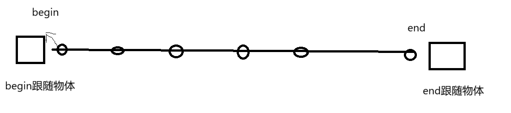
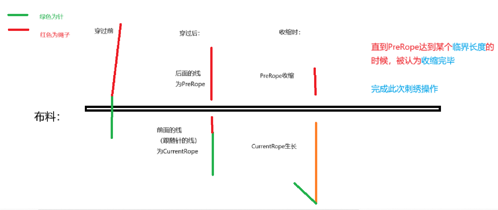

# 刺绣系统实现原理与重要预制体介绍：

##  一.***关于Rope***： 
> 特别提醒：
> 首先，不要随便更改Rope组件的参数。可能会产生意想不到的错误。
> 
> 其次，当你想要更换Rope的创造方式（绳子长度，形状），可以通过RopeBluePrint来实现。但是，请将Rope预制体拖动到ObiSolver预制体下（两者都要拖到Scene场景下）。
> 
> 修改完成之后再完成预制体覆盖（注意，ObiSolver不要进行覆盖。不然会多出一个Rope）

- 预制体位置介绍： Assets/Prefabes/Rope
- 重要依赖预制体位置介绍：Assets/Prefabes/ObiSolver  （Rope必须在这个预制体下才可显现）
#### Rope结构介绍：
- Rope(本体)：组件`SingleRopeHelper`，通过此组件，我们可以:
    - *获取控制一个Rope所需的重要属性*
    - *控制绳子的长度*
    - *控制绳子Begin和End的位置（begin有些忘了能不能）*
    - *控制绳子显示与隐藏*
    - *获取绳子的mesh并生成一个与***当前***绳子模型一致的模型预制体*
    - *指定绳子两端的锁定或者自由状态（**不建议使用**，因为一点free，目前午饭回到原来的指定地点）*
- ObiRope：模拟rope的真正核心（**不建议修改上面的组件参数**）
    - `ObiParticleAttachMent`束缚已经设置好的rope粒子
    - `ObiRope`：核心组件，在此可以设置绳子蓝图
    - `ObiPathSmoother`:设置绳子的光滑度，smoothing参数越大就越光滑（构成整个绳子的段数越多）。也是少数几个可以修改参数的组件
    - `ObiRopeExtrudedRender`:渲染相关，不详
    - `ObiRopeCursor`：绳子剪刀，是控制绳子长度的组件（**但是极度坑，千万别碰其中的参数**）
- begin:绳子头部跟随的物体，修改此物体的transform可以直接修改绳子的头部位置
- end：绳子尾部跟随的物体，修改此物体的transform可以直接修改绳子的尾部位置

### 1. ***操作绳子：*** 

使用脚本 `ObiParticalAttackment`脚本，通过对绳子粒子的束缚来进行实现

如上图所示，你可以认为整个绳子是由很多粒子构成，其中头尾的粒子："begin"和"end"被上面的组件所抓住（只能跟随指定的transform（可以认为是物体的位置）进行移动）。

在也就是说，我们实际上不能够通过控制单个粒子来完成绳子的操控

> 而是通过修改begin和end跟随的**物体的transform**来进行绳子的操控。

详情请看**Rope预制体**的基本解释。

---
### 2. ***绳子穿过布料原理：***

在现实生活中，绳子穿过布料应该还是一根线，但是本系统没有使用这样的方式，原因如下：
- 基于ObiRope插件生成的绳子，由于其本质上是通过绳子的粒子（partical）来完成的物理模拟。由此当一整根绳子穿过模型的时候，他的针脚不会固定，会随着begin和end的改变而"滑动"。

为了解决这个问题：我采用的是依次刺绣操作使用两根绳子来模拟，如：

---
### 3. 性能优化方面：

为了放置每一个绳子都运行自身的Rope组件，减少开销。我在收缩结束的时候，会自动读取PreRope的模型，并生成一个一模一样的模型。

未来打算将其设置成静态物体，减少DrawCall。

（现在也设置了，但是没有起作用，所以其实开销很大。在最小30帧的限制下只能容纳一万根绳子）

---
## 二. ***关于针：*** 
### 1.**Pin预制体的介绍：**
  - 存储位置：位于Assets/Prefabe/Pin
  - 预制体**结构**：
    - Pin（本体）：
      - 其上挂载组件`SinglePinHelper`，是一个帮助我们获得pin上的重要属性(如，beginTrans，endTrans……)，还完成了整个刺绣操作状态上的改变（穿刺前、穿刺后、等等）
      - 其上挂载组件`PinAdsorption`，是一个帮助针头指向单位位置的组件。例如，单位长度为0.1f。那么，针头会指向（0.1f * a, 0.1f * b）的坐标位置。
    - Model：仅仅为挂载的模型
    - begin：被看作成整个针的针头位置。用于碰撞检测
    - end：  
      - 被看作成整个针的针尾部位置。用于**判断针是否穿过布料**。
      - 同时，也是RopeBegin的同步对象。

---
### 2.**针操作器：`PinOperator类`**：

    实现这个类有两个个原因：
    1. 尝试减少VR设备集成难度：
        - 针（pin）会自动的尝试与pinOperator进行"同步"。也就是位置、旋转上的同步。
        - 那么只要控制PinOperator的位置、旋转即可同步完成针位置改变、旋转。
    2. 实现针头指向穿刺点：（具体实现不赘述）

---

- **穿刺布料的判定**：
我在针的两头设置了物理检测区域，在距离布料一段距离的时候才会开启检测。（关于检测区域，可以在scene视窗中看见针两头的球体）

>**特别提醒：** 由于使用的是物理检测区域，因此如果出现穿过布料的速度过快的情况。可能会导致没有检测到。而不会触发上面的刺绣操作。

